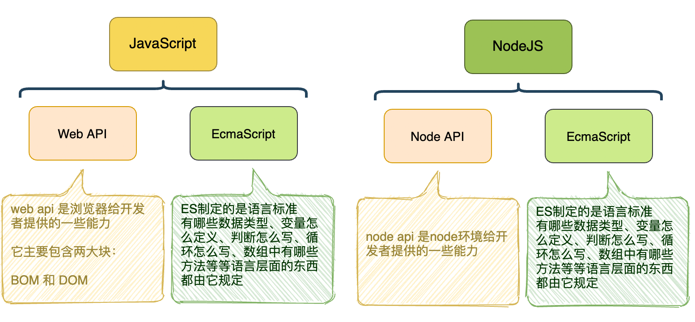
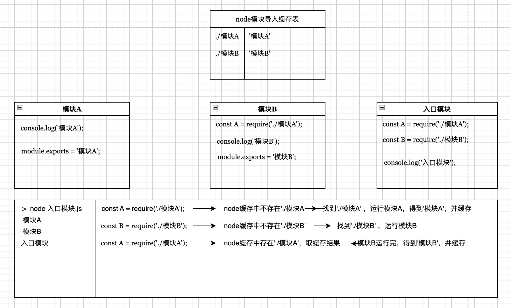

# CommonJS

## 前端模块化标准

前端主要有两大模块化标准：

- **CommonJS**，简称**CMJ**，**社区规范**，目前**仅node环境**支持。
- **ES Module**，简称**ESM**，**官方模块化标准**，目前**浏览器**和**新版node环境**均支持。

## CommonJS实现模块化

> node天生支持CommonJS模块化标准。

**node规定**：

1. node中每个js文件都是一个模块。

2. 通过node命令运行的模块，称之为入口模块（启动模块）。

3. 模块中所有定义的变量、函数、类，都不会污染其他模块。

4. 模块通过`module.exports`导出内容。(`module`是一个对象)

5. 模块通过`require(path)`函数导入内容。（**由于`require`是一个函数，因此可以在任意位置出现**）

   a. 导入模块时，可以省略`.js`。

   b. 导入模块时，必须以`./`或`../`开头。（node内置模块导入直接书写模块名）

6. 一个模块在被导入时会运行一次，然后它的导出结果会被node缓存起来，后续对该模块导入时，不会重新运行，直到使用缓存结果。(**模块导入缓存**)

7. `require`函数会阻塞后续代码的运行，直到`require`函数得到导出结果。

