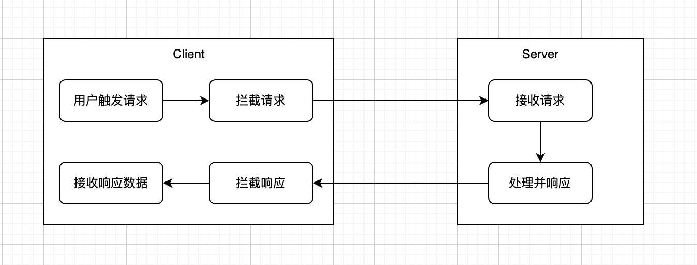

# axios

> 基于**Promise**，可以用于**浏览器**和**nodejs**的网络请求库。


## 1. 起步

### 1.1 axios 是什么？

> **axios**是一个基于**Promise**的网络请求库，作用于**浏览器**和**nodejs**中。（同一套代码可以运行在**浏览器**和**nodejs**中）
>
> - 在**服务端**它使用原生**nodejs**的`http`模块。
> - 在**客户端**（**浏览器**）它使用`XMLHttpRequest`。


### 1.2 特性

- 从**浏览器**创建`XMLHttpRequest`。
- 从**nodejs**创建`http`请求。
- 支持`Promise` API。
- 拦截请求和响应。
- 转换请求和响应数据。
- 取消请求。
- 超时处理。
- 查询参数序列化支持**嵌套项处理**。
- 自动将请求体序列化化为：
  - **JSON**（`application/json`）
  - **Multipart/FormData**（`multipart/form-data`）
  - **URL encoded form**（`application/x-www-form-urlencoded`）
- 将HTML Form转换成JSON进行请求。
- 自动转换JSON数据。
- 获取**浏览器**和**nodejs**的请求进度，并提供额外的信息（速度、剩余时间）。
- 为**nodejs**设置带宽限制。
- 兼容符合规范的**FormData**和**Blob**（包括**nodejs**）。
- 客户端支持防御**`XSRF`**(**跨站请求伪装**)。


### 1.3 安装

使用 **npm**：

```bash
npm i axios
```

使用 **yarn**：

```bash
yarn add axios
```


## 2. 基本用例（example）

> **注意**：**CommonJS**用法
>
> 为了在**CommonJS**中使用`require()`导入时，获得**TypeScript**类型推断（智能感知/自动完成），请使用以下方法：
>
> ```js
> const axios = require('axios').default;
> 
> // axios.<method> 能够提供自动完成和参数类型推断功能
> ```
>
> 


### 2.1 用例(发起一个`GET`请求)

```js
const axios = require('axios');

// 向给定ID的用户发起请求
axios.get('/user?ID=12345').then(function(response){
    // 处理成功情况
	console.log(response);
}).catch(function(error){
	// 处理错误情况
	console.log(error);
}).finally(function(){
    // 不管请求成功还是错误，皆会在处理成功或失败后执行
});


// 上述请求也可以按以下方式完成（可选）
axios.get('/user', {
    params: { // axios会自动将params中的键值对编码后加入到url作为查询参数
        ID: 12345 
    }
}).then(function(response){
    // 处理成功情况
    console.log(response);
}).catch(function(error) {
    // 处理失败情况
    console.log(error);
}).finally(function(){
    // 不管请求是否成功，皆会在处理成功或失败后执行
});
```


### 2.2 用例（发起一个`POST`请求）

```js
axios.post('/user', { // 请求体格式默认：application/json
    firstName: 'li',
    lastName: 'si'
}).then(function(response){
    // 处理成功的请求
    console.log(response);
}).catch(function(error){
    // 处理错误的请求
    console.log(error);
}).finally(function(){
    // 不管请求成功还是失败，皆会在成功请求或错误请求处理完后执行
});
```

#### 2.2.1 发起**多个并发请求**

```js
function getUserAccount(){
    return axios.get('/user/12345');
}

function getUserPermissions(){
    return axios.get('user/12345/permissions');
}

Promise.all([getUserAccount(), getUserPermissions()]).then(function([acct, perm]){
    // ...
}).catch(function(error){
    // ...
});
```


#### 2.2.2 将HTML Form转换成JSON进行请求（`application/json`）

```js
async function getUserInfo() {
    const { data } = await axios.post('/user', document.querySelector('#my-form'), {
       headers: {
           'Content-Type': 'application/json'
       } 
    });
    
    return data;
}
```


#### 2.2.3 Multipart（`multipart/form-data`）

```js
async function userRegister(){
    const { data } = await axios.post('https://httpbin.org/post', {
        firstName: 'li',
        lastName: 'si',
        orders: [1, 2, 3],
        photo: document.querySelector('#fileInput').files  // FileList
    }, {
        headers: {
            'Content-Type': 'multipart/form-data'
        }
    });
    
    return data;
}
```


### 2.2.4 URL encoded form（`application/x-www-form-urlencoded`）

```js
async function userRegister(){
    const { data } = await axios.post('https://httpbin.org/post', {
        firstName: 'li',
        lastName: 'si',
        orders: [1, 2, 3]
    }, {
        headers: {
            'Content-Type': 'application/x-www-form-urlencoded'
        }
    });
    
    return data;
}
```


## 3. Axios API

### 3.1 `axios(config)`

> 可以向`axios` 传递相关配置来创建请求

```js
// 发起一个 POST 请求
axios({
    method: 'POST',
    url: '/user/12345', // 请求路径或请求地址
    data: { // 请求体
        firstName: 'li',
        lastName: 'si'
    }
});
```


### 3.2 `axios(url[, config])`

```js
// 发起一个 GET 请求（默认请求方式）
axios('/user/12345');
```


### 3.3 请求方式别名

```js
- axios.request(config)
- axios.get(url[, config])
- axios.delete(url[, config])
- axios.head(url[, config])
- axios.options(url[, config])
- axios.post(url[,data[, config]])
- axios.put(url[, data[, config]])
- axios.patch(url[, data[, config]])

- axios.postForm(url[, data[, config]])
- axios.putForm(url[, data[, config]])
- axios.patchForm(url[, data[, config]])
```


**注意**：在使用别名方法时，`url`、`method`、`data`这些属性都不必在`config`中指定。


## 4. axios 实例

### 4.1 创建一个实例

> 你可以使用自定义配置新建一个实例：`axios.create([config])`

```js
const instance = axios.create({
    baseURL: 'https://some-domain.com/api/', // 若是实例请求为一个绝对URL地址，则不拼接baseURL
    timeout: 2000, // timeout默认值为0，表示永不超时。实例请求设置的timeout优先级更高
    headers: {
        'X-Custom-Header': 'footbar'
    }
});
```


### 4.2 实例方法

> 以下是可用的实例方法。指定的配置将与实例的配置合并。配置合并规则如下：
>
> ```js
> const configResult = Object.assign({}, axios默认配置, axios实例配置, axios实例请求配置);
> ```

```js
- instance.request(config)
- instance.get(url[, config])
- instance.delete(url[, config])
- instance.head(url[, config])
- instance.options(url[, config])
- instance.post(url[, data[, config]])
- instance.put(url[, data[, config]])
- instance.patch(url[, data[, config]])
- instance.getUri([config])
```


## 5. 请求配置（`config`）

> 这些是创建请求时可以用的配置选项。只有`url`是必需的。如果没有指定`method`，请求将默认使用`GET`方法。基于`axios(url[, config])`

```js
{
  // `url` 是用于请求的服务器 URL
  url: '/user',

  // `method` 是创建请求时使用的方法
  method: 'get', // 默认值

  // `baseURL` 将自动加在 `url` 前面，除非 `url` 是一个绝对 URL。
  // 它可以通过设置一个 `baseURL` 便于为 axios 实例的方法传递相对 URL
  baseURL: 'https://some-domain.com/api/',

  // `transformRequest` 允许在向服务器发送前，修改请求数据
  // 它只能用于 'PUT', 'POST' 和 'PATCH' 这几个请求方法
  // 数组中最后一个函数必须返回一个字符串， 一个Buffer实例，ArrayBuffer，FormData，或 Stream
  // 你可以修改请求头。
  transformRequest: [function (data, headers) {
    // 对发送的 data 进行任意转换处理

    return data;
  }],

  // `transformResponse` 在传递给 then/catch 前，允许修改响应数据
  transformResponse: [function (data) {
    // 对接收的 data 进行任意转换处理

    return data;
  }],

  // 自定义请求头
  headers: {'X-Requested-With': 'XMLHttpRequest'},

  // `params` 是与请求一起发送的 URL 参数
  // 必须是一个简单对象或 URLSearchParams 对象
  params: {
    ID: 12345
  },

  // `paramsSerializer`是可选方法，主要用于序列化`params`
  // (e.g. https://www.npmjs.com/package/qs, http://api.jquery.com/jquery.param/)
  paramsSerializer: function (params) {
    return Qs.stringify(params, {arrayFormat: 'brackets'})
  },

  // `data` 是作为请求体被发送的数据
  // 仅适用 'PUT', 'POST', 'DELETE 和 'PATCH' 请求方法
  // 在没有设置 `transformRequest` 时，则必须是以下类型之一:
  // - string, plain object, ArrayBuffer, ArrayBufferView, URLSearchParams
  // - 浏览器专属: FormData, File, Blob
  // - Node 专属: Stream, Buffer
  data: {
    firstName: 'Fred'
  },
  
  // 发送请求体数据的可选语法
  // 请求方式 post
  // 只有 value 会被发送，key 则不会
  data: 'Country=Brasil&City=Belo Horizonte',

  // `timeout` 指定请求超时的毫秒数。
  // 如果请求时间超过 `timeout` 的值，则请求会被中断
  timeout: 1000, // 默认值是 `0` (永不超时)

  // `withCredentials` 表示跨域请求时是否需要使用凭证
  withCredentials: false, // default

  // `adapter` 允许自定义处理请求，这使测试更加容易。
  // 返回一个 promise 并提供一个有效的响应 （参见 lib/adapters/README.md）。
  adapter: function (config) {
    /* ... */
  },

  // `auth` HTTP Basic Auth
  auth: {
    username: 'janedoe',
    password: 's00pers3cret'
  },

  // `responseType` 表示浏览器将要响应的数据类型
  // 选项包括: 'arraybuffer', 'document', 'json', 'text', 'stream'
  // 浏览器专属：'blob'
  responseType: 'json', // 默认值

  // `responseEncoding` 表示用于解码响应的编码 (Node.js 专属)
  // 注意：忽略 `responseType` 的值为 'stream'，或者是客户端请求
  // Note: Ignored for `responseType` of 'stream' or client-side requests
  responseEncoding: 'utf8', // 默认值

  // `xsrfCookieName` 是 xsrf token 的值，被用作 cookie 的名称
  xsrfCookieName: 'XSRF-TOKEN', // 默认值

  // `xsrfHeaderName` 是带有 xsrf token 值的http 请求头名称
  xsrfHeaderName: 'X-XSRF-TOKEN', // 默认值

  // `onUploadProgress` 允许为上传处理进度事件
  // 浏览器专属
  onUploadProgress: function (progressEvent) {
    // 处理原生进度事件
  },

  // `onDownloadProgress` 允许为下载处理进度事件
  // 浏览器专属
  onDownloadProgress: function (progressEvent) {
    // 处理原生进度事件
  },

  // `maxContentLength` 定义了node.js中允许的HTTP响应内容的最大字节数
  maxContentLength: 2000,

  // `maxBodyLength`（仅Node）定义允许的http请求内容的最大字节数
  maxBodyLength: 2000,

  // `validateStatus` 定义了对于给定的 HTTP状态码是 resolve 还是 reject promise。
  // 如果 `validateStatus` 返回 `true` (或者设置为 `null` 或 `undefined`)，
  // 则promise 将会 resolved，否则是 rejected。
  validateStatus: function (status) {
    return status >= 200 && status < 300; // 默认值
  },

  // `maxRedirects` 定义了在node.js中要遵循的最大重定向数。
  // 如果设置为0，则不会进行重定向
  maxRedirects: 5, // 默认值

  // `socketPath` 定义了在node.js中使用的UNIX套接字。
  // e.g. '/var/run/docker.sock' 发送请求到 docker 守护进程。
  // 只能指定 `socketPath` 或 `proxy` 。
  // 若都指定，这使用 `socketPath` 。
  socketPath: null, // default

  // `httpAgent` and `httpsAgent` define a custom agent to be used when performing http
  // and https requests, respectively, in node.js. This allows options to be added like
  // `keepAlive` that are not enabled by default.
  httpAgent: new http.Agent({ keepAlive: true }),
  httpsAgent: new https.Agent({ keepAlive: true }),

  // `proxy` 定义了代理服务器的主机名，端口和协议。
  // 您可以使用常规的`http_proxy` 和 `https_proxy` 环境变量。
  // 使用 `false` 可以禁用代理功能，同时环境变量也会被忽略。
  // `auth`表示应使用HTTP Basic auth连接到代理，并且提供凭据。
  // 这将设置一个 `Proxy-Authorization` 请求头，它会覆盖 `headers` 中已存在的自定义 `Proxy-Authorization` 请求头。
  // 如果代理服务器使用 HTTPS，则必须设置 protocol 为`https`
  proxy: {
    protocol: 'https',
    host: '127.0.0.1',
    port: 9000,
    auth: {
      username: 'mikeymike',
      password: 'rapunz3l'
    }
  },

  // see https://axios-http.com/zh/docs/cancellation
  cancelToken: new CancelToken(function (cancel) {
  }),

  // `decompress` indicates whether or not the response body should be decompressed 
  // automatically. If set to `true` will also remove the 'content-encoding' header 
  // from the responses objects of all decompressed responses
  // - Node only (XHR cannot turn off decompression)
  decompress: true // 默认值

}
```


## 6. 响应结构

一个请求的响应包含以下信息：

```js
{
  // `data` 由服务器提供的响应
  data: {},

  // `status` 来自服务器响应的 HTTP 状态码
  status: 200,

  // `statusText` 来自服务器响应的 HTTP 状态信息
  statusText: 'OK',

  // `headers` 是服务器响应头
  // 所有的 header 名称都是小写，而且可以使用方括号语法访问
  // 例如: `response.headers['content-type']`
  headers: {},

  // `config` 是 `axios` 请求的配置信息
  config: {},

  // `request` 是生成此响应的请求
  // 在node.js中它是最后一个ClientRequest实例 (in redirects)，
  // 在浏览器中则是 XMLHttpRequest 实例
  request: {}
}
```

当使用`then`时，你将接收如下响应：

```js
axios.get('/user/12345').then(function (response) {
    // 默认情况下，状态码2xx，则Promise为fulfilled
    console.log(response.data);
    console.log(response.status);
    console.log(response.statusText);
    console.log(response.headers);
    console.log(response.config);
    console.log(response.request);
}).catch(function(error){
    // 默认情况下，状态码为非2xx，则Promise为rejected
});
```


## 7. 默认配置

> 指定默认配置，它将作用于每个axios请求(包括实例请求)。


### 7.1 全局 axios 默认值

> 自定义全局 axios 默认值
>
> ```js
> axios.defaults.baseURL = 'https://api.example.com';
> axios.defaults.headers.common['Authorization'] = 'AUTH_TOKEN';
> axios.defaults.headers.post['Content-Type'] = 'application/x-www-form-urlencoded';
> ```
>
> 


### 7.2 自定义实例默认值

```js
// 创建实例时配置默认值
const instance = axios.create({
    baseURL: 'https://api.example.com'
});

// 创建实例后修改默认值
instance.defaults.headers.common['Authorization'] = 'AUTH_TOKEN';
```


### 7.3 配置的优先级

> 配置将会按优先级进行合并，它的顺序是：
>
> - 在`lib/defaults.js`中找到的库默认值。
> - 实例的`defaults`属性。
> - 请求的`config`参数。
>
> 后面的优先级要高于前面的。

```js
// 使用库提供的默认配置创建实例
// 此时超时配置的默认值是 `0`
const instance = axios.create();

// 重写库的超时默认值
// 现在，所有使用此实例的请求都将等待2.5秒，然后才会超时
instance.defaults.timeout = 2500;

// 重写此请求的超时时间，因为该请求需要很长时间
instance.get('/longRequest', {
  timeout: 5000
});
```


## 8. 拦截器

> **请求拦截**：在请求前拦截。
>
> **响应拦截**：在响应被`then` 或 `catch` 处理前拦截。



### 8.1 添加拦截器

```js
// 添加请求拦截器
const requestInterceptor = axios.interceptors.request.use(function(config){
    // 在发送请求之前做些什么， config表示请求配置
    
    return config; // 返回请求配置
}, function(error){
    // 对请求错误做些什么
    
    return Promise.reject(error);
});

// 添加响应拦截器
const responseInterceptor = axios.interceptors.response.use(function(response){
    // 默认 2xx 范围内的状态码都会触发该函数
 	// 对响应数据做点什么
    
    return response;
}, function(error){
    // 默认超出 2xx 范围的状态码都会触发该函数
    // 对响应错误做点什么
    
    return Promise.reject(error);
});
```

### 8.2 移除拦截器

```js
// 移除请求拦截器
axios.interceptors.request.eject(requestInterceptor);
// 移除响应拦截器
axios.interceptors.response.eject(responseInterceptor);
```


### 8.3 axios实例添加拦截器

> axios添加的拦截器，对所有的axios请求和响应都有效。axios实例添加的拦截器，仅对此axios实例的请求和响应有效。

```js
const instance = axios.create();

instance.interceptors.request.use(function(config){
    // 在请求之前做点什么，config为请求配置
    
    return config; // 请求配置
}, function(error){
    // 对请求错误做点什么
    
    return Promise.reject(error);
});
```


## 9. 错误处理

```js
axios.get('/user/12345').catch(function (error) {
    if (error.response) {
      // 请求成功发出且服务器也响应了状态码，但状态代码超出了 2xx 的范围
      console.log(error.response.data);
      console.log(error.response.status);
      console.log(error.response.headers);
    } else if (error.request) {
      // 请求已经成功发起，但没有收到响应
      // `error.request` 在浏览器中是 XMLHttpRequest 的实例，
      // 而在node.js中是 http.ClientRequest 的实例
      console.log(error.request);
    } else {
      // 发送请求时出了点问题
      console.log('Error', error.message);
    }
    console.log(error.config);
});
```


### 9.1 自定义抛出错误的HTTP Code

> 使用`validateStatus`配置选项，可以自定义抛出错误的HTTP code。

```js
axios.get('/user/12345', {
  validateStatus: function (status) {
    // 状态码在[200, 299]以及304，则Promise为fulfilled，否则为rejected
    return status >= 200 && status < 200 || status === 304;
  }
})
```


### 9.2 获取更多错误信息

```js
axios.get('/user/12345').catch(function (error) {
    console.log(error.toJSON());
});
```


## 10. 取消请求

> 从`v0.22.0`开始，axios支持以 fetch API方式：`AbortController`取消请求。
>
> ```js
> const controller = new AbortController();
> axios.get('/foo/bar', {
>     signal: controller.signal
> }).then(function(response){
>     // ...
> });
> 
> // 取消请求，前提：请求还未发出
> controller.abort()
> ```
>
> 


## 11. 请求体编码

> **默认情况下**，axios将Javascript对象序列化为**JSON**。
>
> 若要以`application/x-www-form-urlencoded`格式发送数据，你可以使用以下选项之一：


### 11.1 浏览器

> 在浏览器中，可以使用`URLSearchParams` API,如下所示：
>
> ```js
> const params = new URLSearchParams(); // 是一个可迭代对象
> params.append('param1', 'value1');
> params.append('param2', 'value2');
> 
> axios.post('/foo', params);
> 
> ```
>
> **注意**：不是所有的浏览器都支持`URLSearchParams`。
>
> 或者，你可以使用 `qs` 库编码数据：
>
> ```js
> const qs = require('qs');
> axios.post('/foo', qs.stringify({
>     bar: 123
> }));
> ```
>
> 或者用另一种方式（ES6）
>
> ```js
> import qs from 'qs';
> const data = {
>     bar: 123,
>     name: 'li'
> };
> 
> const config = {
> 	url: '/foo',
>   	method: 'POST',
>   	headers: {
>         'Content-Type': 'application/x-www-form-urlencoded'
>     },
>     data: qs.stringify(data) // 'bar=123&name=li'
> };
> ```
>
> **注意**：如果需要对嵌套对象进行字符串化处理，则最好使用`qs`库。


### 11.2 自动序列化

当请求头中的`content-type`是`application/x-www-form-urlencoded`时，axios将自动地将普通对象序列化成**urlencoded**的格式。


## 12. Multipart 实体请求

> 使用 `multipart/form-data` 类型发起 **POST** 请求。


### 12.1 使用 FormData API


