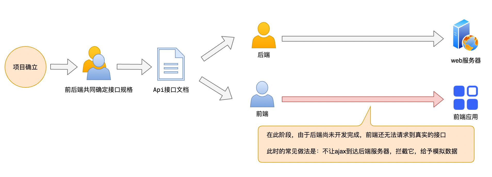
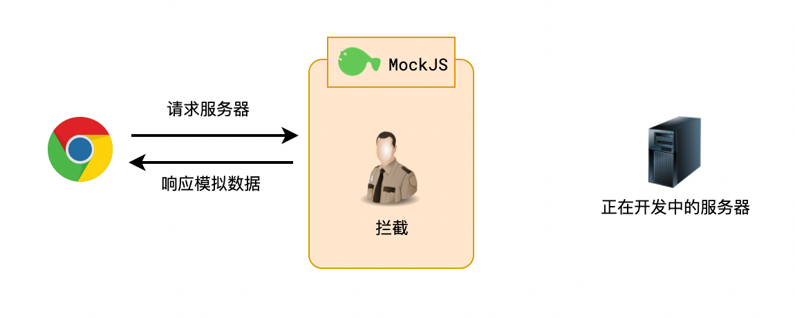

# MockJS

> **拦截Ajax请求，生成随机数据。**[官网](http://mockjs.com/)





## 模拟数据

> Mock.mock(数据模版);

**Mock.js**的语法规范包括两部分：

1. **数据模版定义规范**。
2. **数据占位符定义规范**。

### 数据模版定义规范

> 数据模版中的每个属性由3部分构成：**属性名(name)**、**生成规则(rule)**、**属性值(value)**。
>
> ```js
> 'name|rule': value
> ```
>
> **注意**：
>
> - 属性名 和 生成规则之间用竖线`|`分隔。
> - 生成规则是可选的。
> - 生成规则有7种格式：
>   - `'name|min-max': value`
>   - `'name|count': value`
>   - `'name|min-max.dmin-dmax': value`
>   - `'name|min-max-dcount': value`
>   - `'name|count.dmin-dmax': value`
>   - `'name|count.dcount': value`
>   - `'name|+step': value`
> - 生成规则的含义需要依赖属性值的类型才能确定。
> - 属性值中可以含有`@占位符`。
> - 属性值还指定了最终值的初始值和类型。

```js
Mock.mock({
    'a|2-5': 'ab',
    'b|2': 'cd',
    'c|+1': 0,
    'd|2-8': 0,
    'e|0-10.1-2': 0,
    'f|1': true,
    'g|1-5': true,
    'h|2': {
    	a: 1,
    	b: 2,
    	c: 3
    },
    'i|1-2': {
    	a: 1,
    	b: 2,
    	c: 3
    },
    'j|1': [1, 2, 3, 4],
    'k|+1': [1, 2, 3, 4],
    'l|2-3': [1, 2, 3, 4],
});
```


### 数据占位符定义规范

> 占位符只是在属性值字符串中占个位置，并不出现在最终的属性值中。
>
> 占位符的格式为：
>
> ```js
> @占位符
> @占位符(参数[, 参数])
> ```
>
> 注意：
>
> 1. 用`@`来标识其后的字符串是占位符。
> 2. 占位符引用的是`Mock.random`中的方法。
> 3. 通过`Mock.random.extend()`来扩展自定义占位符。
> 4. 占位符也可以引用数据模版中的属性。
> 5. 占位符会优先引用数据模版中的属性。
> 6. 占位符支持相对路径和绝对路径。

```js
Mock.mock({
    name: {
        first: '@FIRST',
        middle: '@FIRST',
        last: '@LAST',
        full: '@first @middle @last'
    }
})
// =>
{
    "name": {
        "first": "Charles",
        "middle": "Brenda",
        "last": "Lopez",
        "full": "Charles Brenda Lopez"
    }
}
```


## 拦截+模拟数据

> Mock.mock(要拦截的url, 要拦截的请求方法, 数据模板);

```js
```

**注意**：**MockJS**拦截数据的原理是**重写了XMLHttpRequest**。因此它仅能拦截**XHR**的数据请求，而无法拦截使用**fetch**发出的请求。

**MockJS可以拦截**：

- 原生**XMLHttpRequest**
- **jQuery**中的**ajax**
- **axios**


## 模拟网络延时

> Mock.setup({ timeout: 延时时间});

```js
Mock.setup({
    timeout: 400 // 网络延时400毫秒
});

Mock.setup({
    timeout: '200-600' // 网络延时200-600毫秒
});
```


