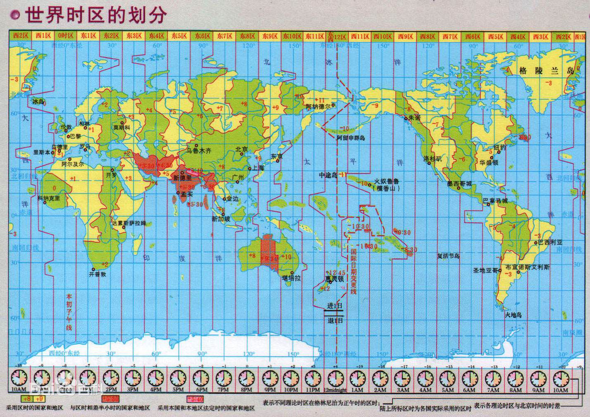
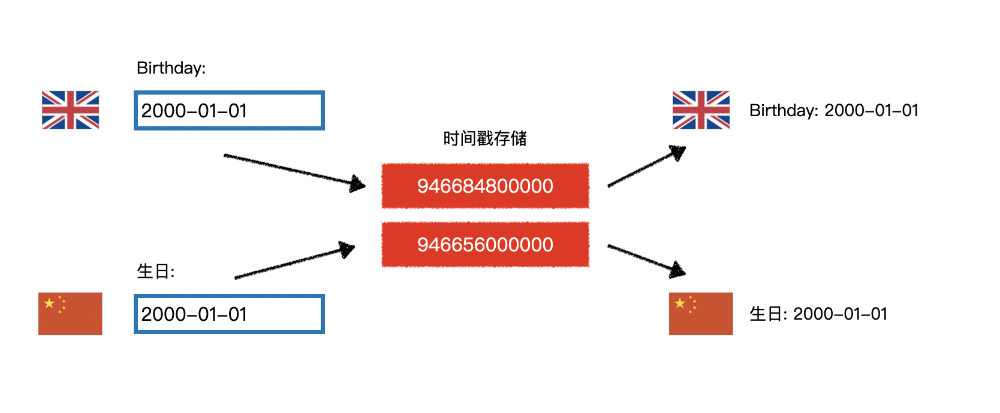
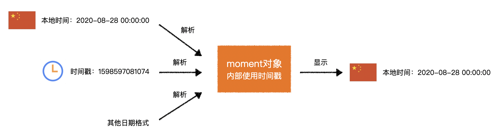

# Moment

> 官网：https://momentjs.com/
>
> 中文网：http://momentjs.cn/
>
> 各种语言包：https://www.bootcdn.cn/moment.js/

Moment提供了强大的日期时间处理能力。


## 时间基础知识

### 单位

| 单位               | 名称 | 换算                  |
| ------------------ | ---- | --------------------- |
| hour               | 小时 | 1 day = 24 hours      |
| minute             | 分钟 | 1 hour = 60 minutes   |
| second             | 秒   | 1 minute = 60 seconds |
| millisecond （ms） | 毫秒 | 1 second = 1000 ms    |
| nanosecond （ns）  | 纳秒 | 1 ms = 1000 ns        |

### GMT和UTC

世界划分为24个时区，北京在东8区，格林威治在0时区。



**GMT**：Greenwish Mean Time 格林威治世界时。太阳时，精确到毫秒。

**UTC**：Universal Time Coodinated 世界协调时。以原子时间为计时标准，精确到纳秒。

> 国际标准中，已全面使用UTC时间，而不再使用GMT时间

GMT和UTC时间在文本表示格式上是一致的，均为`星期缩写, 日期 月份 年份 时间 GMT`，例如：

```
Thu, 27 Aug 2020 08:01:44 GMT
```

另外，ISO 8601标准规定，建议使用以下方式表示时间：

```
YYYY-MM-DDTHH:mm:ss.msZ
例如：
2020-08-27T08:01:44.000Z
```

**GMT、UTC、ISO 8601都表示的是零时区的时间**

### Unix 时间戳

> Unix 时间戳（Unix Timestamp）是Unix系统最早提出的概念

它将UTC时间1970年1月1日凌晨作为起始时间，到指定时间经过的秒数（毫秒数）。

### 程序中的时间处理

> **程序对时间的计算、存储务必使用UTC时间，或者时间戳**。
>
> **在和用户交互时，将UTC时间或时间戳转换为更加友好的文本**。



## Moment核心用法



Moment的使用分为两个部分：

1. 获得Moment对象。
2. 针对Moment对象做各种操作。


