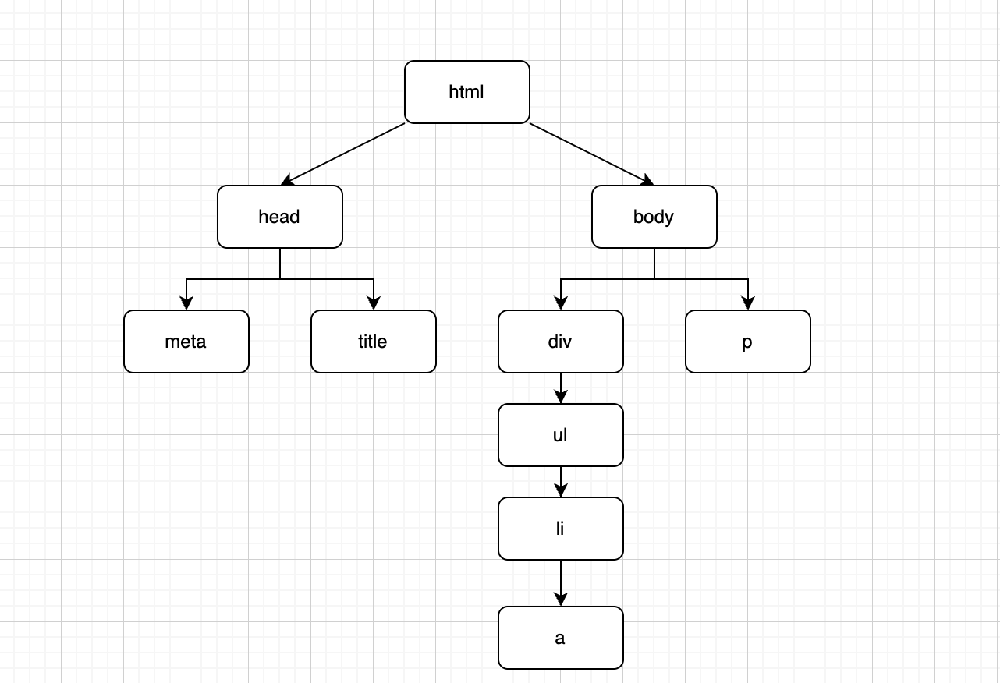

# css属性值的计算过程

> 1. 浏览器是如何解析和渲染网页的？
> 2. css属性值的计算过程。
> 3. 重绘和重构下，浏览器做了什么？


## 浏览器是如何解析和渲染网页的？

```html
<!DOCTYPE html>
<html lang="en">
  <head>
    <meta	charset="utf-8">
    <title></title>
  </head>
  
  <body>
  	<div>
      <ul>
        <li>
        	<a href=""></a>
        </li>
      </ul>
    </div>
    <p></p>
  </body>
</html>
```

1. `<!DOCTYPE html>` ：DTD，文档类型声明。用于告诉浏览器当前文档是HTML5标准。浏览器会使用HTML5标准的语法解析和渲染网页。若是未声明，则当前网页会进入怪异模式渲染。
2. `<html lang="en">`：网页根元素，所有元素都被包含在html元素内。`lang`属性，用于告诉浏览器或搜索引擎机器人，该网页内容使用的是什么自然语言。
3. `<head>` ：`display: none`，不会在页面显示，但依然会被浏览器解析。包含页面元信息、标题、脚本引入、样式引入等信息。
4. `<meta charset="utf-8">`：元信息，用于告诉浏览器当前网页的编码集，浏览器会使用对应的编码集解码。
5. `<title>`：网页标题，展示在标题栏的标题。收藏网页时默认标题。
6. `<body>`：所有显示的内容，都被包含在body元素内。
7. `div => ul => li => a`
8. `p` 




**浏览器是如何解析和渲染网页的？**

- 浏览器是一个元素一个元素依次解析和渲染的。
- 按照网页树形目录结构，以深度优先的方式进行。


## css属性值的计算过程

>  浏览器渲染一个元素的前提：该元素的所有css属性都有值。
>
> [css属性值的计算过程介绍](./introduce.pptx)

一个元素，从所有css属性都没有值，到所有css属性都有值的过程，称为css属性值的计算过程。

**css属性值计算过程：**

1. **确定声明值**：参考**样式表**中没有冲突的声明，作为css属性值。

   样式表：开发者样式表、浏览器默认样式表。

2. **层叠冲突：**对于样式表中冲突的声明使用层叠规则，来确定css属性值。

3. **使用继承：**依然没有值的属性，若是能继承，则继承父元素对应属性的值。

4. **使用默认值**：依然没有值的属性，使用默认值。


**Note：**`inherit`、`initial`、`unset`等css预设值，使css属性具有了声明值。


## 重绘和重构下，浏览器做了什么？

> - 修改元素的装饰性样式，会导致页面重绘。例如：color、background-color、....
>
> - 修改元素的尺寸、位置等与布局相关的样式，以及通过JS获取元素的尺寸和位置，会导致页面的重构。例如：display、width、height、...
>
>   
>
> **网页引发重绘和重构的目的：**获取元素所有css属性最新的值，交给渲染引擎重新渲染网页。
>
> - 获取元素所有css属性最新的值，即为css属性值的计算过程。
> - **重绘：** 仅修改样式的元素，会进行css属性值的计算。
> - **重构：** 除`display: none`的元素外，所有元素都会进行css属性值的计算。