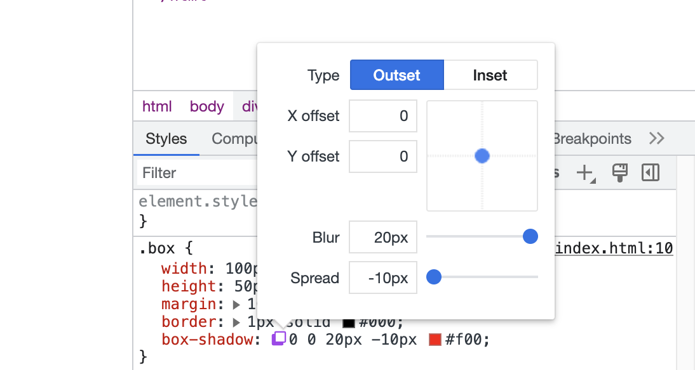

# 盒子阴影(box-shadow)

> `box-shadow`: `none ` | `[<shadow>][,<shadow>]*`

1. `none`：默认值，无阴影。
2. `<shadow>`：
   1. `xOffset`：盒子阴影的水平偏移值，可以为负值。正值向盒子右侧偏移，负值向盒子左侧偏移。**必需**
   2. `yOffset`：盒子阴影的垂直偏移值，可以为负值。正值向盒子底侧偏移，负值向盒子顶侧偏移。**必需**
   3. `blur`：盒子阴影的模糊值半径，值越大越模糊，不可为负值。**可选**
   4. `spread`：盒子阴影的伸缩值半径，可以为负值。正值向外延伸，负值向内收缩。**可选**
   5. `color`：盒子阴影的颜色值，未指定值时，为当前盒子的`color`值。**可选**
   6. `inset`：盒子内阴影，未指定时，为盒子外阴影。**可选**