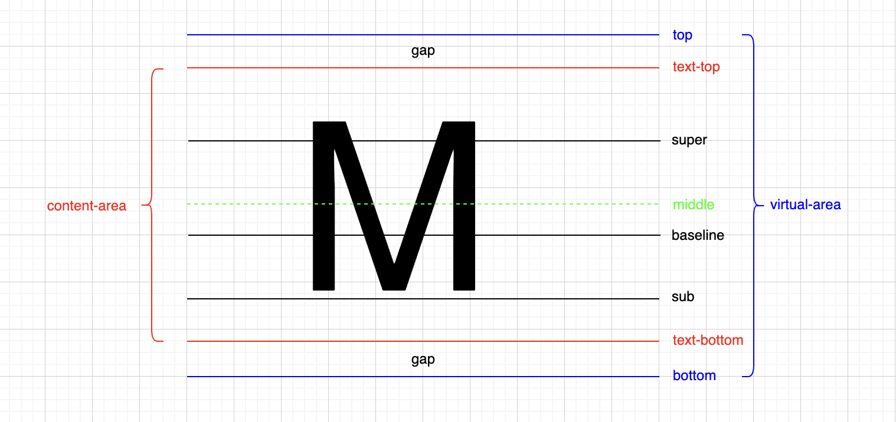

# 文字的行高

> 文字顶线向上延伸的空间，文字底线向下延伸的空间，两个空间相等，该空间叫`gap`(间隙)。
>
> `gap`**默认情况下**，是由字体设计者决定的。

`top`到`bottom`的区域，称为`virtual-area`。

`virtual-area`的高度，即为行高(`line-height`)。

`line-height: normal`，表示文字的默认行高，是由字体设计者决定的。

文字是否出现在一行的最中间，是由字体设计者决定的。(文字是否出现在`content-area`的最中间，是由字体设计者决定的)

`content-area`一定出现在`virtual-area`的最中间。（上下`gap`是相等的）

`line-height: 1`，表示文字的行高等于当前元素的相对字体大小(`font-size`)，而相对字体大小往往小于字体实际大小。因此，会导致文字的行高小于文字的实际大小。

