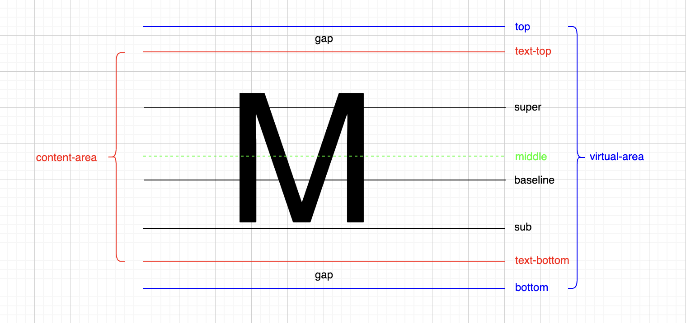

# vertical-align

> - 决定参考线的css属性：`font-family`、`font-size`、`line-height`。
>
> - 若是父元素内存在行盒的子元素或文本，则会在该父元素内创建字体参考线。
>
> - 对于文本，浏览器会创建一个匿名行盒包裹。

**line-box**：

- 行盒组合起来，可以形成多行，每行的区域称为`line-box`。
- `line-box`的顶边，是该行所有行盒最高的`virtual-area`顶边。
- `line-box`的底边，是该行所有行盒最低的`virtual-area`底边。
- 元素计算高度(自动高度)，计算的是元素内所有`line-box`高度之和。
- `line-box`是承载文字的必要条件，以下情况不生成`line-box`：
  - 元素内没有任何行盒和文本。
  - 元素的`font-size`值为0。

**属性值**：

- `baseline`： 默认值，该行盒的基线，与父元素的基线对齐。

- `super`：该行盒的基线，与父元素的上基线对齐。
- `sub`：该行盒的基线，与父元素的下基线对齐。
- `text-top`：该行盒的`virtual-area`顶边，与父元素的`text-top`对齐。
- `text-bottom`：该行盒的`virtual-area`底边，与父元素的`text-bottom`对齐。
- `top`：该行盒的`virtual-area`顶边，与父元素该行的`line-box`的顶边对齐。
- `bottom`：该行盒的`virtual-area`底边，与父元素该行的`line-box`的底边对齐。
- `middle`：该行盒的`content-area`一半位置，与父元素中X字母一半位置对齐。
- 数值：相对于该行盒基线的偏移量，向上为正，向下为负。
- 百分比：百分比计算后的数值，也是相对于该行盒基线的偏移量，向上为正，向下为负。百分比相对于该行盒自身`virtual-area`高度(行高)。

