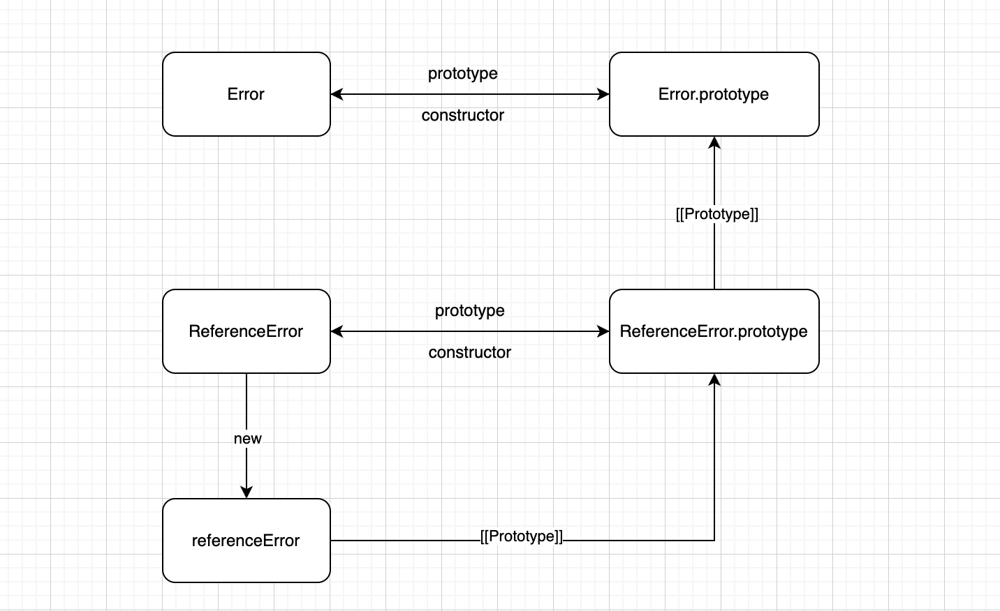

# Error

> 创建一个错误对象。

```js
new Error(message);
Error(message);
```


## Error子类

- 语法错误：`SyntaxError`
- 引用错误：`ReferenceError`
- 类型错误：`TypeError`
- URI错误：`URIError`
- Eval错误：`EvalError`
- 越界错误：`RangeError`


Error子类与Error继承关系




JS简写Error子类继承Error：

```js
// Error
function Error(message = ''){
  this.message = message; // 错误描述信息
  this.stack = (() => {
    return `${this.name}：${this.message}\n${'堆栈信息'}`;
  })(); // 堆栈信息
}

Error.prototype = {
  constructor: Error,
  name: 'Error',
  toString(){
    return this.message;
  }
};

// ReferenceError
function ReferenceError(message) {
  Error.call(this, message);
}

ReferenceError.prototype = Object.create(Error.prototype, {
  constructor: {
    configurable: false,
    enumerable: false,
    writable: false,
    value: ReferenceError
  },
  name: {
    configurable: false,
    enumerable: false,
    writable: false,
    value: 'ReferenceError'
  }
});
```

