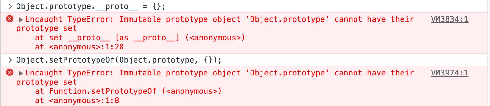
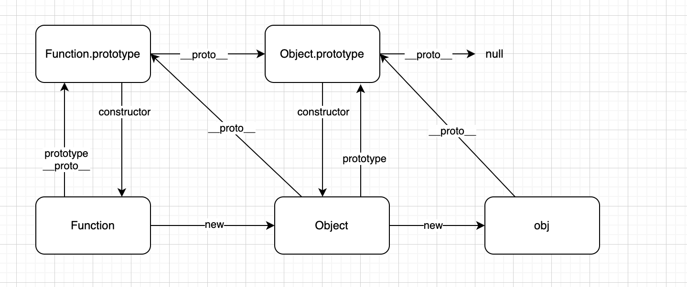

# Object

> 1. `Object`是Javascript一种内置对象。
> 2. `Object`是Javascript提供的构造函数。

1. `Object`实例对象，存储键值对数据。**键只能是字符串。**
2. 可以通过`Object`构造器或对象字面量创建对象。
3. **`Object.prototype`的原型始终为`null`，且不可更改。**



4. 使用`Object.prototype`中的方法，**强烈推荐使用`call`或`apply`调用**，避免`Object.prototype`中方法被重写而产生意外效果。

   

5. 原型为`null`或没有原型的对象，是不继承`Object.prototype`的。

   1. 对象原型为`null`，指的是`对象.__proto__`值为`null`。可以通过`Object.setPrototypeOf(对象, null)`设置对象的原型为`null`。
   2. 对象没有原型，指的是对象中不存在`__proto__`属性。可以通过`Object.create(null)`创建一个没有原型的对象。

## 构造函数

> `new Object(value)`  或 `Object(value)`

`value`可以为任意值：

- 未传递值，或传递值为`null` 或 `undefined`，则创建一个空对象。

```js
Object(); // {}
Object(null); // {}
Object(undefined); // {}
```

- 传递值为**引用值**，则返回引用值地址（引用值地址拷贝赋值）。

```js
Object({});
Object([]);
Object(function(){});
```

- 传递值为**原始值**，例如：数值、字符串、布尔值、符号值、大整数值，则将其封装为对应的包装类对象。

```js
Object(0);
Object('');
Object(false);
Object(Symbol());
Object(0n);
```


**额外**：

- 数值、字符串值、布尔值，既可以使用`Object`封装为对应的包装类对象，也可以使用`Number`、`String`、`Boolean`通过`new`调用封装为包装类对象。

```js
new Number(1);
new String('1');
new Boolean(true);
```

- 符号值、大整数值，只能通过`Object`封装为对应的包装类对象。不能通过`new`调用`Symbol`、`BigInt`构造器封装为包装类对象。(JS阻止`new`调用`Symbol`、`BigInt`构造器，只能将`Symbol`、`BigInt`当做普通函数使用，用来创建符号值、大整数值)。


